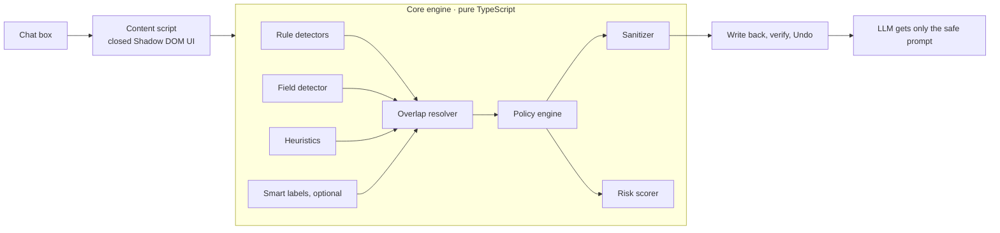

<p align="center">
  
</p>

<h1 align="center">P2Shield</h1>

<p align="center">
  <strong>A pre-LLM privacy firewall that cleans every prompt on your own device, before any LLM/AI tool sees it.</strong>
</p>

<p align="center">
  
  
  
  
  
</p>

<p align="center">
  Team <strong>TechKnights</strong> · BITSHIFT 2026 · Problem Statement 10:
  <em>Pre-LLM Privacy Firewall for Sensitive Data Protection</em>
</p>

---

## Contents

[Overview](#overview) · [Example](#example) · [Features](#features) · [What it understands](#what-it-understands) · [Quick start](#quick-start) · [Usage](#usage) · [Basic and Smart mode](#basic-mode-and-smart-mode) · [Profiles](#privacy-profiles) · [Risk score](#risk-score) · [Architecture](#architecture) · [Privacy and security](#privacy-and-security) · [Library use](#use-the-engine-as-a-library) · [Testing](#testing) · [Layout](#project-layout) · [Limits](#known-limits) · [Roadmap](#roadmap)

---

## Overview

People paste names, Aadhaar numbers, cards, API keys and medical details into AI chatbots every day. Once sent, that data sits on someone else's server. P2Shield puts a shield on any AI chat box. One click finds sensitive data, rewrites the prompt in place according to a privacy policy, and you press Send as usual.

- **On-device.** No proxy, server, account or analytics. The extension makes no network requests.
- **Policy-driven.** Four built-in profiles, editable rules, and organization-pushed policy.
- **Reversible.** Undo restores the original; a review panel lets you keep individual items.
- **Measured.** A 0 to 100 risk score before and after.

## Example

Real engine output, **Healthcare** profile (all sample data is fictional):

```text
BEFORE (risk 99, Critical)
I'm a patient at ABC Hospital in Jamshedpur. My name is Rahul Sharma, I'm 27, my phone
is 98765 43210 and my Aadhaar number is 2345 6789 0124. My doctor Dr. Anil Kumar said
I have Type 2 diabetes and I take Metformin 500mg. You can email me at
rahul.sharma@gmail.com. What questions should I ask my doctor?

AFTER (risk 41, Medium)
I'm a patient at [ORGANIZATION_1] in Jharkhand. My name is [PERSON_1], I'm 20-30, my
phone is [REDACTED_PHONE] and my Aadhaar number is [REDACTED_AADHAAR]. My doctor
Dr. [PERSON_2] said I have Type 2 diabetes and I take Metformin 500mg. You can email me
at [REDACTED_EMAIL]. What questions should I ask my doctor?
```

Identity is removed; the diagnosis stays because the AI needs it to answer.

## Features

| Action | Example |
|---|---|
| Mask | `98765 43210` → `98*** ***10` |
| Tokenize | `Rahul Sharma` → `[PERSON_1]` (same value, same token) |
| Redact | `2345 6789 0124` → `[REDACTED_AADHAAR]` |
| Generalize | `27` → `20-30`; `₹12,50,000` → `approx. ₹13 lakh`; a city → its state |
| Remove secret | `sk-proj-Ab3d...` → `[SECRET_REMOVED]` |
| Keep | `Type 2 diabetes` (needed for the task) |

- **28 data types**, found by rule detectors with checksums, a structured-field detector, heuristics, and optional on-device AI.
- **Secrets are always removed** (passwords, API keys, tokens, private keys, credentials in URLs) in every profile. A custom or imported profile cannot change this.
- **Settings app** with an overview, playground, mode and policy editors, per-site controls and a metadata-only audit log.

## What it understands

- **Structured data:** JSON, JS/Python objects, YAML, `.env`, HTTP headers, XML, function arguments, CLI flags, CSV / TSV / Markdown tables, and prose ("my routing number is ...").
- **Field names in any style** (`api_token`, `apiToken`, `X-Api-Key`, `routing_num`). The name proposes a type and the value's shape confirms it, so `"card_token_raw": "5412..."` is a card while `"card_token_raw": "tok_9f..."` is a secret. Descriptive keys (`token_type`) and code references (`os.environ[...]`) are left alone.
- **Identifiers:** Aadhaar (Verhoeff), PAN, GSTIN, IFSC, UPI, US SSN and ABA routing, UK NINO / NHS / sort code, Canadian SIN, Brazilian CPF, Emirates ID, Singapore NRIC, SWIFT/BIC, IBAN (mod-97), Luhn-checked cards, passports, driving licences, tax IDs, medical and insurance numbers, crypto wallets and seed phrases.
- **Credentials and infrastructure:** 30+ named token formats (OpenAI, Anthropic, AWS, GitHub, Stripe, Slack, Google and more), private keys, JWTs, bearer auth, webhook URLs, internal hostnames, cloud ARNs, IP / MAC addresses, and user names in file paths.
- **Checksums keep false alarms low**, and numbers are never matched inside a longer token.

## Quick start

Requires Node.js 20+ and Chrome (or another Chromium browser) 116+.

```bash
git clone https://github.com/Ravindra-builds/P2Shield
cd P2Shield
npm install
npm run build
```

Open `chrome://extensions`, turn on **Developer mode**, click **Load unpacked**, and choose the `dist` folder. To try it on the bundled demo chat page:

```bash
npm run demo        # http://localhost:4173/
```

## Usage

1. Click into any AI chat box. A shield appears above the top-right corner of the input card.
2. Type or paste. A badge on the shield counts what would be protected; its colour shows the risk.
3. Click the shield. The box now holds the safe prompt (`Protected 5 items · Risk 99 → 63`).
4. **Undo** restores your text. **Details** lists each finding so you can keep an item (except secrets).

| Other ways in | How |
|---|---|
| Shortcut | `Alt+Shift+S` on the focused box (change at `chrome://extensions/shortcuts`) |
| Context menu | Right-click a text box, *Protect this text with P2Shield* |
| Toolbar icon | Opens settings and the playground |

The shield shows automatically on common AI sites (ChatGPT, Claude, Gemini, Copilot, Perplexity, DeepSeek, Grok, Mistral and more) and on any box that looks like a chat prompt. Turn on *Show on every text box* in settings for everything else. The shortcut and context menu work everywhere.

The **Playground** accepts pasted text or a `.txt`, `.md`, `.csv`, `.json` or `.log` file (2 MB max) and shows highlighted findings, risk before and after, and the safe version. PDF and Office files are not supported.

## Basic mode and Smart mode

**Basic** (default) uses rules and heuristics and works in every Chromium browser.

**Smart** adds Chrome's on-device model (Gemini Nano, via the Prompt API) on top of the rules. It judges which details your request actually needs, so profiles with *keep if needed* (Finance, Enterprise) keep a diagnosis while protecting the name and ID.

- The model only **labels**. Our code does every replacement, the policy decides, and each label must appear verbatim in your text.
- It never sees your secrets: values the rules already found are replaced by placeholders first.
- It never makes you wait: the model warms up on focus, labels in the background while you type, and if it hasn't answered within 0.7 s of your click, the rules protect the text immediately and the model's extras are applied when they arrive.
- If the model is missing, slow (20 s) or invalid, the Basic result stands.

Needs desktop Chrome, about 22 GB free disk, a GPU with more than 4 GB VRAM (or 16 GB RAM), and a one-time ~4 GB download. Check at `chrome://on-device-internals`.

## Privacy profiles

| Data type | Personal | Healthcare | Finance | Enterprise |
|---|---|---|---|---|
| Person name | Tokenize | Tokenize | Tokenize | Tokenize |
| Email | Mask | Redact | Mask | Tokenize |
| Phone | Mask | Redact | Mask | Redact |
| Cards, accounts, UPI | Mask | Redact | Mask | Redact |
| Government IDs | Redact | Redact | Redact | Redact |
| Age | Keep | Generalize | Generalize | Generalize |
| Location | Keep | Generalize | Keep | Generalize |
| Organization | Keep | Tokenize | Keep | Tokenize |
| Medical | Keep | Keep | Tokenize\* | Tokenize\* |
| Money amounts | Keep | Generalize | Generalize | Generalize |
| Secrets | Removed | Removed | Removed | Removed |
| Confidence threshold | 0.50 | 0.50 | 0.50 | 0.45 |

\* Kept when Smart mode says it is needed for the task.

Edit any rule in the **Privacy policy** view, save a copy under a new name, or import / export profiles as JSON. IT teams can push policy through Chrome managed storage (`profileId`, `lockProfile`, `mode`, `showOnAll`, `disabledSites`, `customProfile`; see `src/managed_schema.json`). This is implemented but untested on a real enterprise deployment.

## Risk score

Each distinct value contributes `weight × confidence × residual`, combined like independent probabilities so one secret is already critical and many small items never exceed 100. Residual is what remains after the action (Keep 1.0, Generalize 0.4, Mask 0.25, Tokenize 0.1, Redact or Remove 0). A diagnosis or salary with no identity attached scores lower than the same fact next to a name and phone number.

| Score | 0 to 30 | 31 to 60 | 61 to 80 | 81 to 100 |
|---|---|---|---|---|
| Level | Low | Medium | High | Critical |

The weights are product design choices, not a standard.

## Architecture



| Module | Role |
|---|---|
| `src/core` | Detection, policy, risk, sanitizer, Smart-mode helpers (no browser APIs) |
| `src/content` | Finds editors, draws the shield, writes text back |
| `src/background` | Shortcut, context menu, audit log, model bridge |
| `src/offscreen` | Hosts the Prompt API (unavailable in service workers) |
| `src/options` | Settings app and playground |

**Writing back** is the hard part on real sites. Plain inputs use the native value setter plus an `input` event. Rich editors (ProseMirror, Lexical, Slate, Quill, Draft) get a simulated paste or editing commands, then a text fallback. Every attempt is verified by reading the box back; if all fail, the safe prompt is copied to the clipboard.

## Privacy and security

- No network requests, remote code or analytics from the extension. (Chrome itself downloads the Gemini Nano model if you enable Smart mode.)
- Your text and detected values are never stored. The audit log keeps only time, site, mode, profile, counts by type and risk (last 200 entries, clearable). Token maps live in memory only.
- The in-page UI is in a closed Shadow DOM and uses no `innerHTML`.
- Permissions: `storage` (settings, audit log), `contextMenus`, `offscreen` (model host), `clipboardWrite` (fallback copy), and a content script on all pages so the shield can appear on any chatbot.

## Use the engine as a library

`src/core` has no browser dependencies:

```ts
import { analyze, getBuiltinProfile } from './src/core';

const { result } = analyze('My name is Rahul Sharma, key sk-proj-Ab3dEf9hIjKlMnOpQrStUv12', {
  profile: getBuiltinProfile('enterprise'),
});
result.safeText;    // text with every value replaced
result.riskBefore;  // 0-100 (riskAfter, levelBefore, levelAfter also available)
result.findings;    // type, text, action, replacement, confidence, reason
result.tokenMap;    // '[PERSON_1]' -> original value, in memory only
```

## Testing

```bash
npm test             # unit tests (Vitest)
npm run typecheck
npm run e2e          # loads the built extension into Chromium and drives the demo page
```

The first e2e run needs `npx playwright install chromium`. Unit tests cover the engine, structured formats, worldwide identifiers, ordinary prompts that must stay unchanged, profiles saved by older versions, Smart mode with a mocked model, and a speed budget (about 10-20 ms for 20,000 characters). The 30 e2e checks cover five editor types, multi-line credentials, a JSON config with six sensitive values, shield placement, Undo, page re-renders, profiles, disabled sites, the shortcut path, the Smart-mode fallback, and that the audit log never contains raw values.

Not automatically tested: real chat sites (they need a login and change often), Smart mode with a real model, and managed policy on a real device. For live sites, paste a fictional prompt, click the shield, press Send, then check Undo, line breaks, and the next message.

## Project layout

```text
src/            core, content, background, offscreen, options, shared, icons, manifest
tests/          unit tests
e2e/            Playwright end-to-end run
demo/           demo chat page and static server
landing page/   standalone marketing site (React, Vite, Tailwind)
packages/p2shield/   npm package scaffold
scripts/        make-icons.mjs (icons from p2shield-logo.png)
build.mjs       esbuild bundler
```

| Command | Does |
|---|---|
| `npm run build` | Bundle the extension into `dist/` |
| `npm run check` | Run typecheck, unit tests, and build in one step |
| `npm test` / `npm run test:watch` | Run unit tests (single-run or watch mode) |
| `npm run demo` / `npm run dev` | Serve the local demo chat page |
| `npm run build:package` | Bundle the pure engine into `packages/p2shield/dist` |
| `npm run icons` | Re-generate icons from `p2shield-logo.png` |
| `npm run landing` / `npm run build:landing` | Run / build the standalone landing page |
| `npm run build:all` | Build extension, npm package, and landing page |

## Known limits

- **It reduces accidental exposure; it is not a guarantee.** Spelled-out values and secrets with no recognisable format or field name can slip through, and name detection in Basic mode is heuristic.
- **The page can still see what you type.** P2Shield protects what gets **sent**. For very sensitive text, use the Playground and paste only the safe version.
- Prompt injections are not detected; the values they would extract are removed.
- The engine scans up to 400,000 characters; the live badge samples the first 20,000.
- Text only: no images, OCR, PDF or Office files.
- Restoring real values in the AI's reply is not implemented.
- Site changes can break box detection or write-back; the shortcut and context menu are the fallback.
- Chromium only; Smart mode is Chrome only.

## Roadmap

- [ ] Restore real values in the AI's response using the local token map
- [ ] PDF and DOCX extraction, OCR for images
- [ ] A local NER model for stronger name detection
- [ ] Hindi and other Indian-language support
- [ ] An organization gateway for apps outside the browser
- [ ] Tamper-evident audit hashes

## License

MIT. See [`packages/p2shield/LICENSE`](packages/p2shield/LICENSE).
